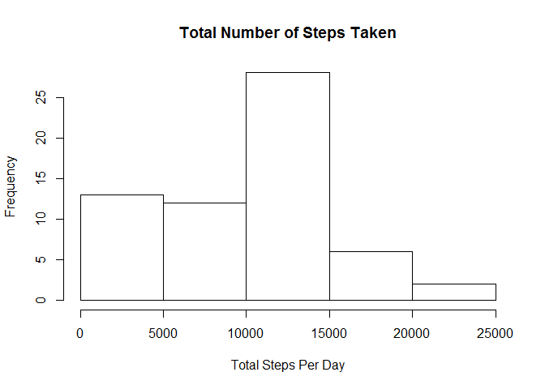
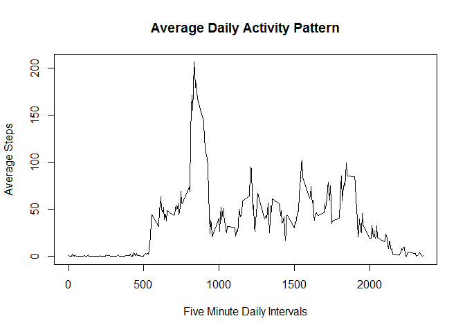
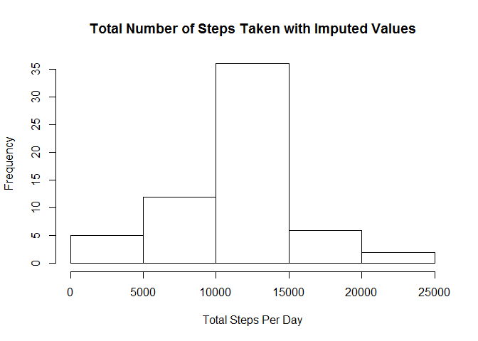
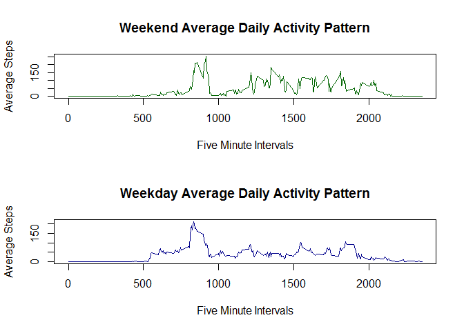

# Reproducible Research: Peer Assessment 1
cdo03c  
Wednesday, February 11, 2015  


```r
sessionInfo()
```

```
## R version 3.1.2 (2014-10-31)
## Platform: x86_64-w64-mingw32/x64 (64-bit)
## 
## locale:
## [1] LC_COLLATE=English_United States.1252 
## [2] LC_CTYPE=English_United States.1252   
## [3] LC_MONETARY=English_United States.1252
## [4] LC_NUMERIC=C                          
## [5] LC_TIME=English_United States.1252    
## 
## attached base packages:
## [1] stats     graphics  grDevices utils     datasets  methods   base     
## 
## loaded via a namespace (and not attached):
## [1] digest_0.6.4     evaluate_0.5.5   formatR_1.0      htmltools_0.2.6 
## [5] knitr_1.9        rmarkdown_0.2.68 stringr_0.6.2    tools_3.1.2     
## [9] yaml_2.1.13
```

```r
Sys.time()
```

```
## [1] "2015-02-11 20:48:53 GMT"
```

###Loading and Preprocessing the Data


```r
if(!file.exists("./data")){dir.create("./data")}
if(!file.exists("./data/activity.zip")){download.file(url = "https://github.com/cdo03c/RepData_PeerAssessment1/blob/master/activity.zip?raw=true", destfile = "./data/activity.zip", mode = "wb")}
unzip(zipfile = "./data/activity.zip", exdir = "./data")
WD <- getwd()
setwd("./data")

activity <- read.csv(file = "activity.csv", header = T, colClasses = c("integer", "Date", "integer"))
```

###Part 1: Total Number of Steps Taken Per Day

Based on the recorded activity from the personal activity monitoring device, below is a histogram showing the frequencies of the total number of steps taken per day with the missing data removed.  The most number of days have total steps between 10,000 and 15,000.


```r
library("plyr")

dailytotal <- ddply(activity, .(date), summarize, total_steps = sum(steps, na.rm = TRUE))
hist(dailytotal$total_steps, main = "Total Number of Steps Taken", xlab = "Total Steps Per Day")
```

 

```r
stepsmean <- round(mean(dailytotal$total_steps, na.rm = T))
stepsmedian <- round(median(dailytotal$total_steps, na.rm = T))
```

The mean for the total number of steps taken in a day is 9354 and the median for the total number of steps taken in a day is 1.0395\times 10^{4}.


###Part 2: Average Daily Activity Pattern

The recorded activity levels revealed the following daily activity pattern with the missing data removed:


```r
intervalavg <- ddply(activity, .(interval), summarize, avg_steps = mean(steps, na.rm = TRUE))
plot(x = intervalavg$interval, y=intervalavg$avg_steps, type ="l", main = "Average Daily Activity Pattern", xlab = "Five Minute Daily Intervals", ylab = "Average Steps")
```

 

```r
maxint <- subset(intervalavg, intervalavg$avg_steps == max(intervalavg$avg_steps))
```

The five-minute interval during the day that has the highest average steps is 835.


###Part 3: Imputing the Missing Values

Based on the recorded activity from the personal activity monitoring device, below is a histogram showing the frequencies of the total number of steps taken per day with the missing data imputed based on the average for the given time interval of missing data.  The most number of days have total steps between 10,000 and 15,000, which is the same as when missing values are removed from the data.


```r
missing <- sum(is.na(activity))

activityfull <- activity
for(i in 1:nrow(activityfull)){
    if(is.na(activityfull[i,1])){
        activityfull[i,1] <- intervalavg[which(grepl(paste('^', activityfull[i,3], '$', sep = ""), intervalavg$interval)),2]
    }
}

dailytotalfull <- ddply(activityfull, .(date), summarize, total_steps = sum(steps, na.rm = TRUE))
hist(dailytotalfull$total_steps, main = "Total Number of Steps Taken with Imputed Values", xlab = "Total Steps Per Day")
```

 

```r
stepsmeanfull <- round(mean(dailytotalfull$total_steps, na.rm = T))
stepsmedianfull <- round(median(dailytotalfull$total_steps, na.rm = T))
```

The number of missing values that were imputed is 2304. The mean for the total number of steps taken in a day with missing values imputed is 1.0766\times 10^{4} and the median for the total number of steps taken in a day is 1.0766\times 10^{4}.  The mean and median of the data with the imputed values is higher than when the missing values are removed.


###Part 4: Weekday and Weekend Activity Patterns
 

```r
for (i in 1:nrow(activityfull)){
   if(weekdays(activityfull[i,2]) == "Saturday"){
       activityfull[i,4] <- "Weekend"
   }
   else{
       activityfull[i,4] <- "Weekday"
   }
}
colnames(activityfull) <- c("steps", "date", "interval", "weekpart")
 
weekday <- subset(activityfull, activityfull$weekpart == "Weekday")
weekend <- subset(activityfull, activityfull$weekpart == "Weekend")
 
weekdayavg <- ddply(weekday, .(interval), summarize, avg_steps = mean(steps, na.rm = TRUE))
weekendavg <- ddply(weekend, .(interval), summarize, avg_steps = mean(steps, na.rm = TRUE))
 
par(mfrow = c(2, 1))
 
plot(x = weekendavg$interval, y=weekendavg$avg_steps, type ="l", main = "Weekend Average Daily Activity Pattern", xlab = "Five Minute Intervals", ylab = "Average Steps", col = "dark green")
plot(x = weekdayavg$interval, y=weekdayavg$avg_steps, type ="l", main = "Weekday Average Daily Activity Pattern", xlab = "Five Minute Intervals", ylab = "Average Steps", col = "dark blue")
```

 


```r
setwd(WD)
rm(activity, WD, dailytotal, weekday, weekend, activityfull)
```
